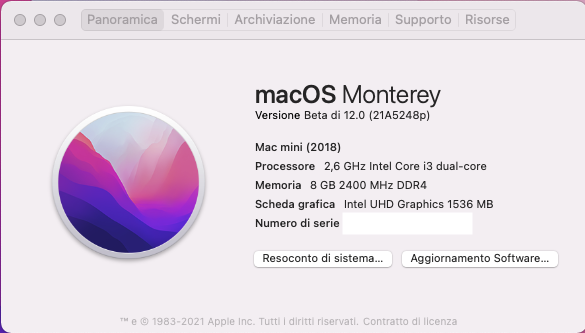
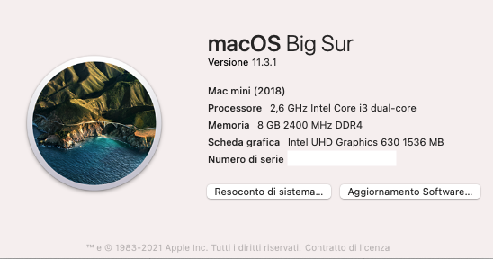
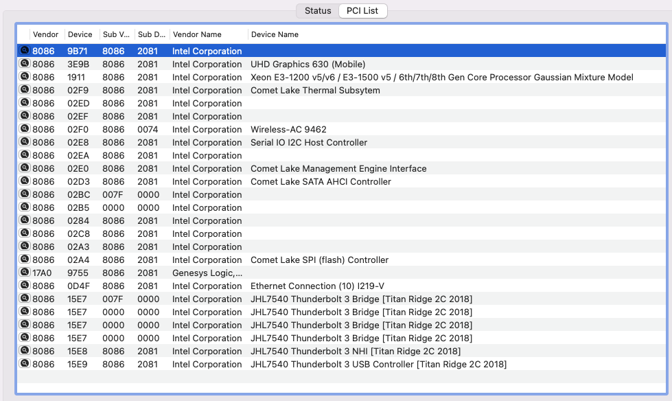
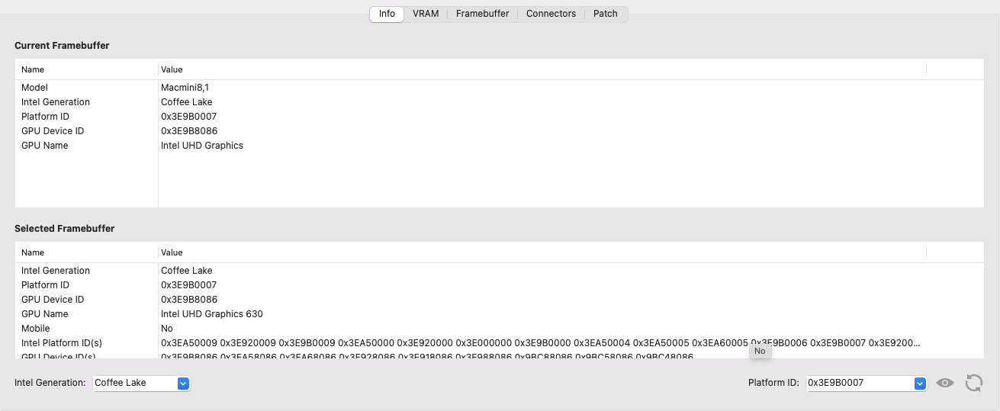
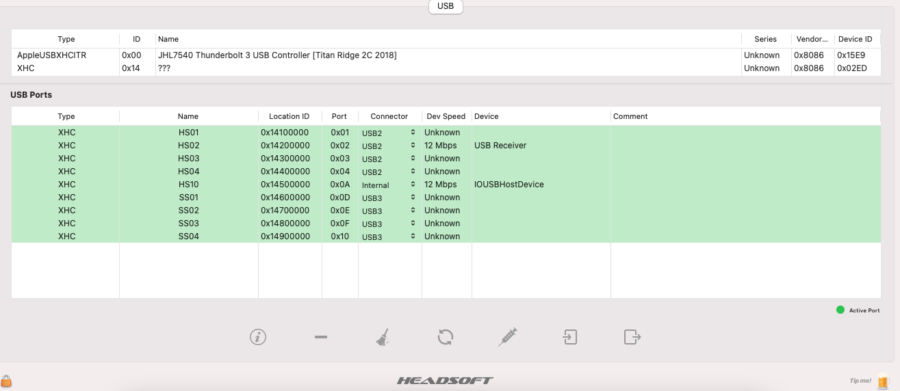
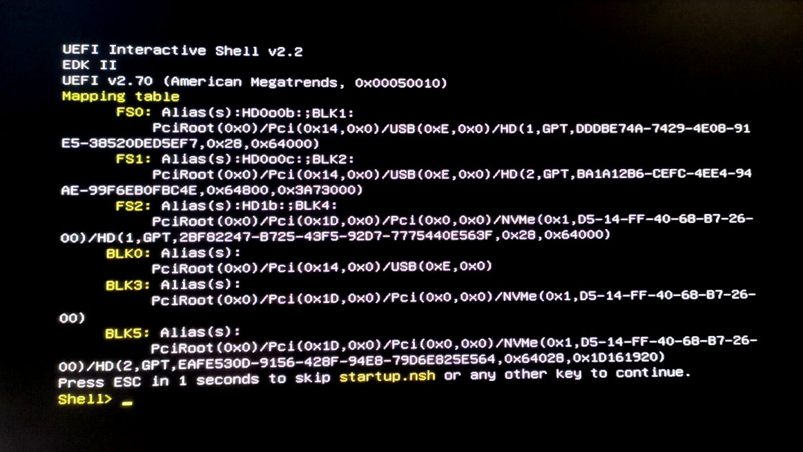
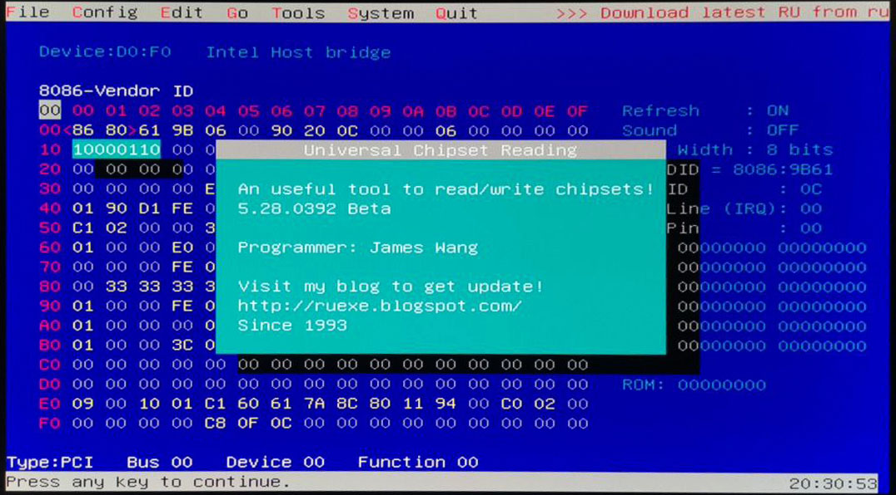

# Intel NUC10i3FNK Hackintosh

EFI for Intel NUC10i3FNK with OpenCore bootloader

### Computer Spec:

| Component        | Brank                                  |
| ---------------- | ---------------------------------------|
| CPU              | Intel® Core™ i3-10110U                 |
| iGPU             | Intel® UHD630                          |
| Lan              | Intel I219-V                           |
| Audio            | Realtek ALC256                         |
| Ram              | 8  Gb ddr4 2400 Mhz                    |
| Wifi + Bluetooth | Intel® Wireless-AX201 + Bluetooth      |
| Nvme             | Kingston SA400 120Gb.                  |
| Card Reader.     | SD Card Reader                         |
| SmBios           | MacMini8,1                             |
| BootLoader       | OpenCore                               |

## Peripherals

### What works and What doesn't or WIP:

- [x] Intel Intel® UHD 630 iGPU HDMI Output
- [x] ALC256 Internal Speakers
- [x] ALC256 HDMI Audio Output
- [x] All USB Ports 
- [x] SpeedStep / Sleep / Wake
- [x] Intel I219-V10
- [x] Thunderbolt 3 port
- [x] AX 201 Wireless + Bluetooth
- [x] microSDXC Card Reader
- [x] NVRAM

### BIOS Settings:
To start, choose "Load Defaults" (choose from the menu or press F9 in the BIOS setup).

Then change:
+ Advanced
  - Storage
    * SATA Mode Selection -> AHCI
  - Video
    * IGD Minimum Memory -> 64MB
    * IGD Aperture Size -> 256MB
    * IGD Primary Video Port -> Auto
+ Boot 
  - Secure Boot
    * Secure Boot -> Disabled
  - Boot Priority
    * UEFI Boot -> Checked
    * Legacy Boot -> Unchecked
    * Fast Boot -> Unchecked
+ Power
  - Secondary Power Settings
    * Deep S4/S5 -> On
    * Wake on Lan from S4/S5 -> Stay Off
    * Wake System from S5 -> Off
    * Wake From Thunderbolt Device -> Off

### Special Config:

- Usb port mapping performed
- Disabled unused device

## CFG Unlock 

N.B. this procedure is very risky.
Any responsibility for this function is discharged to those who perform it.
Be very careful when making this change.

Let's start by downloading the file [RU.efi](./CFGunlock/RU.efi)

We format the USB in FAT32 format.
We copy the RU.efi file in the USB Root.
We enable the UEFI Shell parameter from the BIOS.
We attach the USB stick to the PC and start the UEFI Shell by pressing F10.

If everything is correct, we will come to this screen:

We will then have to find our ROOT, which in my case is FS1
So now we will write "fs1:"
Then we will write "ls"

We will find ourselves in this situation at this point:

Then type RU.efi and this mask will appear.

Press ALT + ì to remove the popup on the screen.
At this point, on the keyboard, press PagDOWN to scroll the list.

We need to get to the "CPUSetup"

And click ENTER to access the section.

Now we have to go down to the value "0030 - 0E

Now let's change the value 01 to 00

The correct version will be the following:

Now to save we press CTRL + W

If everything went well, we will have this screen with a red popup

Enjoy

### SSDT Info

See [ioreg](./macmini.ioreg) for more clarification

## Credits

- [Apple](https://apple.com) for macOS.
- Intel for this mini pc.
- [Acidanthera](https://github.com/acidanthera) for OpenCore and all the lovely hackintosh work.
- [Dortania](https://github.com/dortania) For great and detailed guides.
- [Lorys89](https://github.com/Lorys89) For continuos support, patches and sleepless nights.
- [Hackintoshlifeit](https://github.com/Hackintoshlifeit) Support group for installation and post installation.

### If you need help please contact us on [Telegram](https://t.me/HackintoshLife_it)